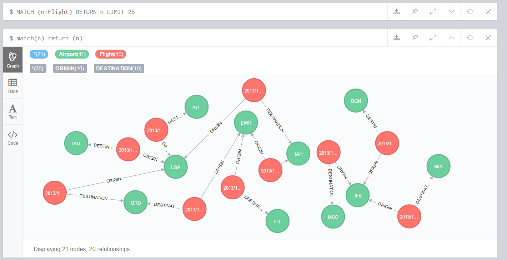

```{r setup, include=FALSE}
knitr::opts_chunk$set(echo = TRUE)
```


## Output sql table into CSV
```{r,warning=FALSE}
suppressMessages(library(RMySQL))
suppressMessages(library(RNeo4j))
con<-dbConnect(MySQL(),user='root',password='',dbname='flights', host='localhost')
sql<-"select * from flights"
res<- dbGetQuery(con,sql)
df<-data.frame(res)
write.csv(df,"flights.csv",row.names=F)
dbDisconnect(con)
```

## Read csv into R

for Neo4j visualization, I just use the first 10 rows in the table 
```{R}
file<-file("flights.csv",open="r")
data<-read.csv(file,header=TRUE,stringsAsFactors =FALSE )
close(file)
df<-data.frame(data)
df<-df[1:10,]
df

```
## Create graph
```{r}
graph=startGraph("http://localhost:7474/db/data/")
#clear(graph)
```

## Create Neo4j Schema using RNeo4j
```{r}
query="MERGE (origin:Airport {name:{origin}})
MERGE (destination:Airport {name:{dest}})
CREATE (origin)<-[:ORIGIN]-(:Flight {number:{flight_num},date:{flight_date},arrival:{arr_time},depart:{dep_time}})-[:DESTINATION]->(destination)"

t<- newTransaction(graph)
for (i in 1:nrow(df))
{
  origin<-df[i,]$origin
  dest<-df[i,]$dest
  flight<-paste(df[i,]$carrier,df[i,]$flight)
  flight_date<-paste(df[i,]$year,'/',df[i,]$month,'/',df[i,]$day,sep='')
  arr_time<- df[i,]$arr_time
  dep_time<-df[i,]$dep_time
  appendCypher(t,query,origin=origin,dest=dest,flight_date=flight_date,arr_time=arr_time,dep_time=dep_time,flight_num=flight)
  
}
commit(t)
```

## Table view of Neo4j database in R
```{r}
cypher(graph,"MATCH (o:Airport)<-[:ORIGIN]-(f:Flight)-[:DESTINATION]->(d:Airport) RETURN o.name,f.number,f.date,f.arrival,f.depart,d.name")
```



With the graph we can see the relationship between airports more clearly and we can also see mutiple relationships between airports which is not that obverious in table view. We also store the flight information and airport information into seperate node which makes it more easier to visualize it.

